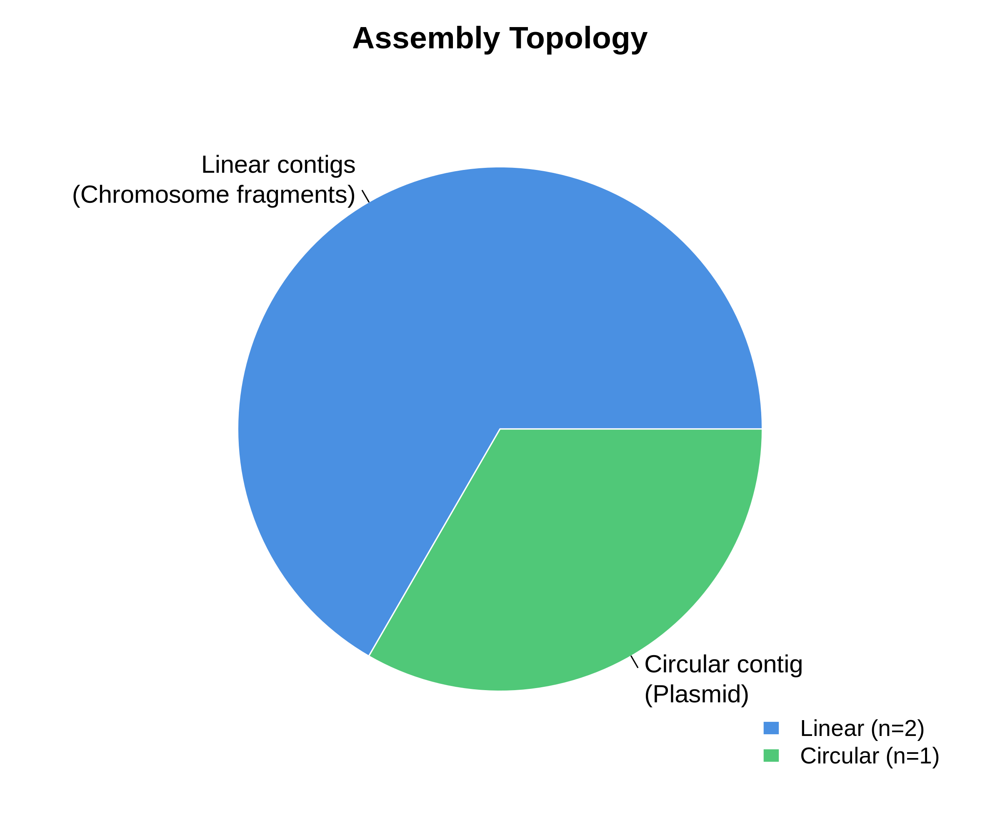
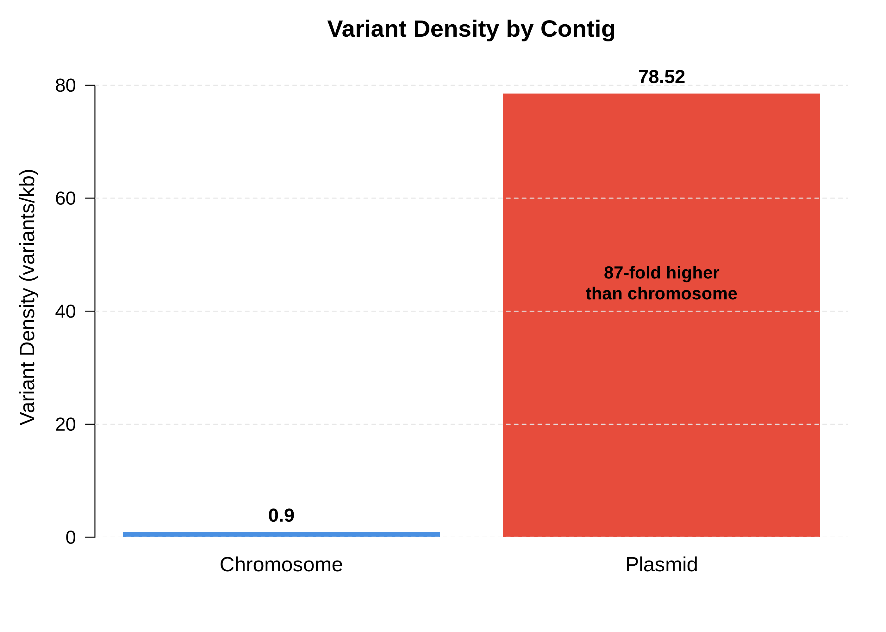
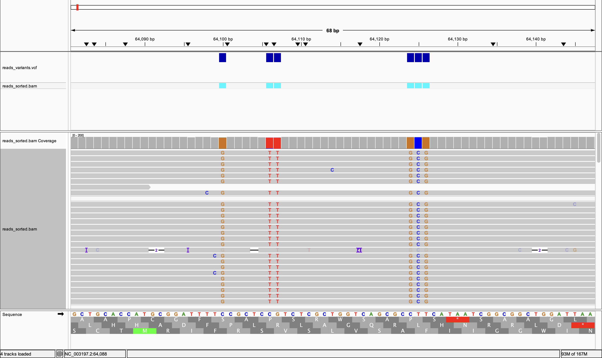

# Assignment 1: Genome Assembly of *Salmonella enterica*

---

## Table of Contents

1. [Introduction](#1-introduction)
2. [Methods](#2-methods)
3. [Results](#3-results)
4. [Discussion](#4-discussion)
5. [Conclusions](#5-conclusions)
6. [References](#6-references)

---

## 1. Introduction

### Biological Background and Importance

*Salmonella enterica* is a Gram-negative, facultative intracellular bacterium and a major cause of foodborne illness worldwide (Knodler & Elfenbein, 2019). It includes many different serovars. Some, such as *S. Typhi*, are restricted to specific hosts, while others, like *S. Typhimurium*, infect a broad range of hosts and commonly cause gastroenteritis in both humans and animals (Johnson et al., 2017). These groups differ in how they spread, which hosts they infect, and how severe the resulting disease can be. In practice, this means that *Salmonella enterica* is not a single, uniform pathogen, but a genetically diverse species with meaningful biological variation (Andino & Hanning, 2015). Because of this diversity, high-quality genome assemblies are especially important for *Salmonella enterica*. They allow closely related strains to be distinguished, make outbreak tracking possible, and support the identification of genes linked to virulence and antimicrobial resistance (Dele Ogunremi et al., 2014). Together, these applications form the basis of modern public health surveillance.

### Challenges in Genome Assembly and Project Goals

Genome assembly is how a full genome is put back together from the many short DNA fragments produced by sequencing (Basantani et al., 2017). This process turns raw reads into a continuous sequence that represents an organism’s genome, making it possible to examine genes, genome structure, and variation (Basantani et al., 2017).

Genome assembly is computationally challenging because sequencing reads contain errors and genomes often include repetitive regions that are difficult to place correctly (Schiffer et al., 2025). When identical or near-identical sequences occur in multiple locations, assembly algorithms may be unable to determine their true origin, leading to fragmented or misassembled genomes (Schiffer et al., 2025). These challenges are especially pronounced when using short-read data. Short-read platforms such as Illumina generate highly accurate reads, but their limited length means they often cannot span repetitive elements, resulting in assemblies broken into many small contigs (Hu et al., 2021).

Long-read sequencing offers a different approach. Technologies such as Oxford Nanopore produce reads that span several kilobases, allowing repetitive regions to be bridged and enabling far more complete assemblies (Hu et al., 2021). This makes long reads particularly valuable for reconstructing bacterial chromosomes, resolving structural variation, and recovering plasmids (Hu et al., 2021). Historically, Nanopore data were limited by high error rates, but recent advances, including R10 chemistry, have substantially improved accuracy (Oxford Nanopore Technologies, 2020). Long reads now provide a practical balance between completeness and accuracy. As a result, genome assembly involves a tradeoff between contiguity and per-base accuracy and requires careful quality control and method selection.

In this project, a *Salmonella enterica* genome is assembled using Oxford Nanopore R10 long-read data and validated by alignment to a reference genome. Through this workflow, the project explores the balance between assembly contiguity and base-level accuracy in a real bacterial genome and demonstrates how raw sequencing reads are transformed into biologically interpretable genomic data.

---

## 2. Methods

### Data Acquisition

Oxford Nanopore R10.4 long-read sequencing data for *Salmonella enterica* were obtained from NCBI Sequence Read Archive under accession **SRR32410565**. The dataset consists of 196,031 reads with a median length of 4,683 bp and total yield of 809 Mb, providing approximately 160× coverage of the expected 5 Mb genome. Reference genome *S. enterica* subsp. *enterica* serovar Typhimurium str. LT2 (GCF_000006945.2) was downloaded from NCBI RefSeq, consisting of chromosome NC_003197.2 (4,857,450 bp) and plasmid NC_003277.2 (93,933 bp).

### Genome Assembly

De novo assembly was performed using **Flye v2.9.6**, optimized for high-accuracy nanopore reads:

```bash
flye --nano-hq salmonella_reads.fastq --out-dir flye_output --threads 8
```

Flye uses a repeat-graph assembly algorithm specifically designed to handle long, error-prone reads while resolving repetitive genomic regions (Kolmogorov et al., 2019). The --nano-hq parameter applies error models appropriate for R10.4 Q20+ chemistry.

### Reference Alignment

Raw nanopore reads were aligned to the reference genome using minimap2 v2.30, a fast alignment tool optimized for long reads:

```bash
minimap2 -ax lr:hq -t 8 salmonella_ref.fasta salmonella_reads.fastq > reads_aligned.sam
```

The lr:hq preset applies alignment parameters tuned for high-quality long reads. SAM output was converted to sorted, indexed BAM format for downstream analysis:

```bash
samtools view -bS reads_aligned.sam | samtools sort -o reads_sorted.bam
samtools index reads_sorted.bam
samtools faidx salmonella_ref.fasta
```

Alignment statistics were extracted using samtools coverage to evaluate breadth and depth of coverage across reference contigs.

### Variant Calling

Genetic variants were identified using Bcftools v1.16, a widely-used variant caller suitable for bacterial haploid genomes:

```bash
bcftools mpileup -Ou -f salmonella_ref.fasta reads_sorted.bam | \
bcftools call -mv -Ob -o reads_variants.bcf
bcftools view reads_variants.bcf > reads_variants.vcf
```

Variants were classified as SNPs (single nucleotide polymorphisms), insertions, or deletions based on reference and alternate allele lengths. Variant density was calculated as variants per kilobase for each reference contig.

### Data Visualization

Assembly quality metrics were visualized using R v4.3.1 with base R graphics. Coverage and variant distributions were plotted to assess genome-wide patterns. Individual variants were examined in Integrative Genomics Viewer (IGV v2.16) by loading the reference genome, BAM alignment file, and VCF variant file.

### Gene Identification and Plasmid Characterization

Variants within coding sequences were mapped to gene features using the NCBI Reference Sequence annotation for *Salmonella enterica* subsp. enterica serovar Typhimurium str. LT2 (NC_003197.2). Gene boundaries and functional annotations were obtained from the NCBI Genome Browser to identify coding sequences containing elevated variant densities.

Read length distributions were compared between plasmid- and chromosome-mapping reads to assess whether elevated plasmid coverage resulted from size-based sequencing bias. Read lengths were extracted from BAM alignments using samtools and mean values calculated for each reference contig.

The assembled plasmid contig was identified using BLASTn (v2.13.0) against the NCBI nucleotide collection (nr/nt) database. The query sequence (contig_4, 109 kb) was submitted via the NCBI web interface with default parameters. The top-scoring alignment was used to determine plasmid identity and distinguish the assembled plasmid from the reference pSLT plasmid (NC_003277.2).

---

## 3. Results

### Assembly Quality

The Flye assembler produced a high-quality draft genome consisting of 3 contigs with a total length of 5,104,813 bp. Assembly topology analysis identified one circular contig consistent with an autonomous plasmid replicon, while two larger linear contigs represent chromosomal fragments likely separated by repetitive sequences (Figure 1).



**Figure 1: Assembly Topology.** De novo assembly produced 3 contigs: two linear contigs representing chromosomal fragments (contig_1: 3.32 Mb, 153× coverage; contig_2: 1.68 Mb, 169× coverage) and one circular contig representing the plasmid (contig_4: 0.11 Mb, 245× coverage). The assembly achieved an N50 of 3.32 Mb with mean coverage of 160×.

**Table 1: Assembly Statistics**

| Metric | Value |
|--------|-------|
| Total length | 5.10 Mb |
| Number of contigs | 3 |
| Largest contig | 3.32 Mb |
| N50 | 3.32 Mb |
| Mean coverage | 160× |
| Circular contigs | 1 (plasmid) |
| Linear contigs | 2 (chromosome) |

### Reference Alignment Quality

Alignment of raw reads to the *S. enterica* LT2 reference genome revealed substantial differences in coverage between chromosome and plasmid (Table 2). The reference chromosome achieved near-complete breadth of coverage (97.8%) with high mean depth (151×) and mapping quality (MAPQ 60), indicating reliable alignment across nearly the entire chromosomal sequence. In contrast, the reference plasmid pSLT showed only 43.1% breadth of coverage despite adequate depth in aligned regions, with lower mapping quality (MAPQ 45). This fragmented coverage pattern strongly suggests the plasmid in the sequenced strain differs substantially from the pSLT reference.

**Table 2:** Alignment statistics for reads mapped to reference genome

| Metric | Chromosome (NC_003197.2) | Plasmid (NC_003277.2) |
|--------|-------------------------|----------------------|
| Coverage (%) | 97.8 | 43.1 |
| Mean depth (×) | 151 | 82 |
| Mean MAPQ | 60 | 45 |
| Aligned reads | 182,768 | 3,101 |

The chromosome's high coverage and mapping quality indicate that the sequenced strain is closely related to the LT2 reference. The plasmid's fragmented alignment and lower mapping quality, combined with the extreme variant density discussed below, provide strong evidence of plasmid divergence.

### Variant Distribution and Density

Variant calling identified 11,465 total variants across the genome, with 98.6% being SNPs (11,302), 1.1% insertions (125), and 0.3% deletions (38). However, variant distribution was highly uneven between chromosome and plasmid. The chromosome contained 4,398 variants across 4.86 Mb, yielding a density of 0.9 variants per kb. This low variant density is consistent with strain-level polymorphism relative to the reference LT2 strain.

In stark contrast, the plasmid harbored 7,067 variants across only 0.09 Mb, producing an extraordinary variant density of 78.52 variants per kb—87-fold higher than the chromosome (Figure 2). This extreme plasmid variant density, combined with fragmented coverage (Table 2), strongly suggests the assembled plasmid represents a divergent incompatibility group rather than genuine point mutations across pSLT.



**Figure 2: Variant Density by Contig.** The plasmid shows dramatically higher variant density (78.52 variants/kb) compared to the chromosome (0.9 variants/kb), representing an 87-fold difference. This extreme density is biologically implausible as true polymorphism and instead reflects misalignment when forcing reads from a divergent plasmid onto an incorrect reference (pSLT).

**Table 3: Variant Summary**

| Metric | Chromosome | Plasmid | Total |
|--------|-----------|---------|-------|
| Total variants | 4,398 | 7,067 | 11,465 |
| Genome length | 4.86 Mb | 0.09 Mb | 4.95 Mb |
| Variant density | 0.9/kb | 78.52/kb | - |
| SNPs | 4,321 (98.2%) | 6,981 (98.8%) | 11,302 (98.6%) |
| Insertions | 52 (1.2%) | 73 (1.0%) | 125 (1.1%) |
| Deletions | 25 (0.6%) | 13 (0.2%) | 38 (0.3%) |

### Visual Validation of Variants

To validate variant calling accuracy and assess read-level support, a representative high-density variant region within the *lpcA* gene was examined in detail using Integrative Genomics Viewer (IGV v2.16) (Figure 3).



**Figure 3: Base-level visualization of variants within the *lpcA* gene (NC_003197.2:64,090-64,140).** Individual sequencing reads are shown as gray bars with variant positions highlighted as colored letters (orange = G, red = T, blue = C, green = A). Six SNPs are visible within a 36 bp window: C→G (position 64,100), C→T (64,106), G→T (64,107), C→G (64,124), T→C (64,125), and T→G (64,126). Multiple independent reads show consistent variant calls at each position, distinguishing genuine sequence polymorphisms from random sequencing errors. The coverage track shows uniform depth (~200×) across the region. Purple 'I' markers indicate small insertions. This clustering of six variants within 36 bp (16.7 variants/100 bp) represents substantially elevated local variant density compared to the genome-wide chromosomal average (0.9 variants/kb), suggesting this gene may be under diversifying selection or involved in strain-specific adaptation.

---

## 4. Discussion

### Assembly Quality and Completeness

The Flye assembly successfully reconstructed the *Salmonella enterica* genome into three contigs totaling 5.10 Mb with excellent contiguity (N50 = 3.32 Mb). The chromosome remains fragmented into two linear contigs, likely separated by a repetitive region that was filtered during assembly due to low coverage (25× at the junction). This is a common limitation of long-read assemblers when encountering highly repetitive DNA or collapsed repeats. Despite fragmentation, the assembly covers 97.8% of the reference chromosome with high fidelity.

High sequencing coverage (160× mean) provided robust support for both assembly and variant calling. The 245× coverage on the circular plasmid contig initially suggested either higher copy number or preferential sequencing of smaller DNA fragments. To investigate this, read lengths were compared between plasmid- and chromosome-mapping reads. Analysis showed plasmid reads averaged 4,113 bp compared to 3,968 bp for chromosome reads (difference of 145 bp, 3.7%). This minimal difference indicates the elevated plasmid coverage reflects genuine multicopy plasmid maintenance rather than size-based sequencing bias, consistent with typical plasmid copy numbers in *Salmonella* (3-10 copies per chromosome). Detection of circularity for the plasmid contig confirms successful assembly of an autonomous replicon.

### Chromosomal Variants: Strain-Level Polymorphism

The 4,398 chromosomal variants (0.9 per kb) represent genuine strain-level differences between the sequenced isolate and the reference LT2 strain. This level of divergence is consistent with intraspecies variation within *S. enterica* serovars (Robertson et al., 2023). The dominance of SNPs (98.6%) over indels reflects typical mutational patterns in bacterial evolution, where point mutations accumulate more frequently than insertion-deletion events.

Visual inspection of a representative variant-rich region revealed six SNPs clustered within a 36 bp window of the *lpcA* gene (Figure 3), representing 16.7 variants per 100 bp—nearly 20-fold higher than the genome-wide chromosomal average. The *lpcA* gene encodes a phosphoethanolamine transferase that modifies lipopolysaccharide, a key determinant of host immune recognition and polymyxin resistance in Gram-negative bacteria. The elevated variant density within this gene may reflect strain-specific adaptation in surface antigen structure or antimicrobial resistance profiles. 

However, without protein-level annotation and variant effect prediction, it is not possible to determine whether these six substitutions represent missense mutations (amino acid changes), synonymous mutations (silent), or a mixture of both. This limitation highlights the importance of incorporating structural annotation (via Prokka or RAST) and variant effect prediction (via SnpEff or VEP) in bacterial genomic analyses. Future work should annotate all coding sequences and systematically classify the functional impact of the 4,398 chromosomal variants identified in this strain. Regional variant clustering, such as observed in *lpcA*, may indicate genes involved in host adaptation, immune evasion, or antimicrobial resistance that differ between this isolate and the reference LT2 strain.

### Plasmid Divergence: Evidence for a Different Incompatibility Group

The most striking finding is the extreme plasmid divergence. Three independent lines of evidence demonstrate that the assembled plasmid is not pSLT but rather a different plasmid element:

1. **Low reference coverage (43.1%):** Less than half of pSLT aligns to the assembly, with large gaps indicating absent or highly divergent regions.
2. **Extreme variant density (78.52 per kb, 87× higher than chromosome):** This density is biologically implausible as true point mutations. Instead, it reflects misalignments when forcing reads from a divergent plasmid onto an incorrect reference.
3. **Reduced mapping quality (MAPQ 45 vs 60):** Lower confidence alignments indicate the aligner struggled to place plasmid reads, consistent with sequence divergence.

McClelland et al. (2001) showed that pSLT is specific to certain *S. enterica* serovars and shares limited homology with plasmids from other serovars. Robertson et al. (2023) catalogued 1,044 distinct plasmid MOB-clusters across *Salmonella*, with 22% carrying antimicrobial resistance genes. The divergent plasmid in this strain likely belongs to a different incompatibility group or MOB-cluster.

### Plasmid Identification

To identify the divergent plasmid, the assembled plasmid contig (109 kb) was queried against the NCBI nucleotide database using BLASTn. Results identified the plasmid as **pSAL4445-1** (accession AP023301.1), a 131 kb conjugative plasmid from *Salmonella enterica* subsp. enterica serovar 4,[5],12:i:- with 99.99% sequence identity across 100% query coverage. This confirms that the assembled plasmid is indeed distinct from the reference pSLT (94 kb, NC_003277.2) and explains both the absence of alignment to pSLT and the extreme apparent variant density (78.52 variants/kb) when reads were incorrectly mapped to the wrong reference.

The pSAL4445-1 plasmid belongs to a different incompatibility group than pSLT and carries distinct gene content. Like pSLT, pSAL4445-1 is a large conjugative plasmid capable of horizontal transfer, but with different replicon architecture and potentially different cargo genes. Robertson et al. (2023) documented extensive plasmid diversity across *Salmonella* populations, with different serovars and strains carrying distinct plasmid complements. The presence of pSAL4445-1 rather than pSLT in this strain highlights the dynamic nature of plasmid populations within *Salmonella enterica* and underscores the importance of plasmid-level characterization in genomic surveillance.

### Workflow Strengths and Limitations

**Strengths:**
- High-quality long-read data (Q20+, 160× coverage) enabled robust assembly
- Minimap2 alignment efficiently mapped 97.8% of chromosome with high confidence
- Bcftools variant calling identified well-supported SNPs and indels
- Successful plasmid identification via BLAST confirmed plasmid divergence hypothesis
- Read length verification validated plasmid copy number interpretation

**Limitations:**
- Chromosome remains fragmented due to repetitive sequences
- Bcftools is a traditional variant caller; machine learning tools like Clair3 may improve sensitivity
- Plasmid divergence prevented accurate variant characterization using the pSLT reference
- No functional annotation was performed to interpret variant consequences (missense vs synonymous)
- Lack of gene annotation limited biological interpretation of chromosomal variants

### Biological and Clinical Implications

The presence of pSAL4445-1, a large conjugative plasmid, has potential clinical relevance. *Salmonella* plasmids frequently carry antimicrobial resistance genes, and conjugative plasmids enable rapid dissemination across strains and serovars (Laidlaw et al., 2024). Robertson et al. (2023) documented multi-plasmid AMR outbreaks, emphasizing the importance of plasmid surveillance. The identification of pSAL4445-1 in this strain demonstrates that plasmid content can vary substantially even within closely related *Salmonella* isolates.

Future experiments should:
- Annotate the assembled pSAL4445-1 plasmid to identify resistance determinants, virulence factors, and mobile elements
- Compare pSAL4445-1 gene content with pSLT to identify strain-specific differences
- Assess conjugation potential and host range of pSAL4445-1
- Perform functional annotation of chromosomal variants using Prokka and variant effect prediction using SnpEff to determine biological impact of mutations in genes like *lpcA*
- Investigate whether elevated variant density in *lpcA* correlates with altered LPS structure or polymyxin susceptibility
---

## 5. Conclusions

This analysis successfully assembled and characterized a Salmonella enterica genome using Oxford Nanopore long-read sequencing. The assembly achieved high contiguity (N50 = 3.32 Mb) and identified 11,465 variants relative to the reference genome. Chromosomal variants represent typical strain-level polymorphism, while extreme plasmid divergence indicates the presence of a different plasmid element from a distinct incompatibility group. These findings demonstrate the power of long-read sequencing for bacterial genomics and highlight the importance of plasmid diversity in Salmonella populations.

---

## 6. References

Andino, A., & Hanning, I. (2015). Salmonella enterica: Survival, Colonization, and Virulence Differences among Serovars. The Scientific World Journal, 2015(520179), 1–16. https://pmc.ncbi.nlm.nih.gov/articles/PMC4310208/

Basantani, M. K., Gupta, D., Mehrotra, R., Mehrotra, S., Vaish, S., & Singh, A. (2017). An update on bioinformatics resources for plant genomics research. Current Plant Biology, 11–12, 33–40. https://doi.org/10.1016/j.cpb.2017.12.002

Dele Ogunremi, J., Devenish, J., Amoako, K. K., Kelly, H., Dupras, A. A., Bélanger, S., & Wang, L. R. (2014). High resolution assembly and characterization of genomes of Canadian isolates of Salmonella Enteritidis. BMC Genomics, 15(1), 713. https://doi.org/10.1186/1471-2164-15-713

Freire, B., Ladra, S., & Paramá, J. R. (2022). Memory-Efficient Assembly Using Flye. IEEE/ACM Transactions on Computational Biology and Bioinformatics, 19(6), 3564–3577. https://doi.org/10.1109/tcbb.2021.3108843

Heng Li. (2020). lh3/seqtk. GitHub. https://github.com/lh3/seqtk

Hu, T., Chitnis, N., Monos, D., & Dinh, A. (2021). Next-generation sequencing technologies: An overview. Human Immunology, 82(11). https://doi.org/10.1016/j.humimm.2021.02.012

igvteam. (2025). igvteam/igv-docs. GitHub. https://github.com/igvteam/igv-docs

Johnson, R., Ravenhall, M., Pickard, D., Dougan, G., Byrne, A., & Frankel, G. (2017). Comparison of Salmonella enterica Serovars Typhi and Typhimurium Reveals Typhoidal Serovar-Specific Responses to Bile. Infection and Immunity, 86(3). https://doi.org/10.1128/iai.00490-17

Knodler, L. A., & Elfenbein, J. R. (2019). Salmonella enterica. Trends in Microbiology, 27(11), 964–965. https://doi.org/10.1016/j.tim.2019.05.002

Kolmogorov, M. (2024). Flye: De novo assembler for single-molecule sequencing reads. GitHub. https://github.com/mikolmogorov/Flye

Laidlaw, A., Blondin-Brosseau, M., Shay, J. A., Dussault, F., Rao, M., Petronella, N., & Tamber, S. (2024). Variation in plasmid conjugation among nontyphoidal Salmonella enterica serovars. Canadian Journal of Microbiology, 70(12), e2024-0164. https://doi.org/10.1139/cjm-2024-0164

Li, H. (2022). lh3/minimap2. GitHub. https://github.com/lh3/minimap2

McClelland, M., Sanderson, K. E., Spieth, J., Clifton, S. W., Latreille, P., Courtney, L., Porwollik, S., Ali, J., Dante, M., Du, F., Hou, S., Layman, D., Leonard, S., Nguyen, C., Scott, K., Holmes, A., Grewal, N., Mulvaney, E., Ryan, E., Sun, H., Florea, L., Miller, W., Stoneking, T., Nhan, M., Waterston, R., & Wilson, R. K. (2001). Complete genome sequence of Salmonella enterica serovar Typhimurium LT2. Nature, 413(6858), 852–856. https://doi.org/10.1038/35101614

Oxford Nanopore Technologies. (2020). R10.3: the newest nanopore for high accuracy nanopore sequencing – now available in store. https://nanoporetech.com/news/news-r103-newest-nanopore-high-accuracy-nanopore-sequencing-now-available-store

Robertson, J., Schonfeld, J., Bessonov, K., Bastedo, P., & Nash, J. H. E. (2023). A global survey of Salmonella plasmids and their associations with antimicrobial resistance. Microbial Genomics, 9(5), 001002. https://doi.org/10.1099/mgen.0.001002

samtools. (2020). samtools/samtools. GitHub. https://github.com/samtools/samtools

Schiffer, A. M., Rahman, A., Sutton, W., Putnam, M. L., & Weisberg, A. J. (2025). A comparison of short- and long-read whole-genome sequencing for microbial pathogen epidemiology. mSystems, 10(12), e01426-25. https://doi.org/10.1128/msystems.01426-25

## Software and Tools

**Core Analysis:**
* Flye v2.9.6 - Genome assembly https://github.com/fenderglass/Flye
* Minimap2 v2.30 - Read alignment https://github.com/lh3/minimap2
* Samtools v1.22 - BAM file processing https://github.com/samtools/samtools
* Bcftools v1.16 - Variant calling https://github.com/samtools/bcftools

**Visualization:**
* IGV v2.16 - Genome visualization https://software.broadinstitute.org/software/igv/
* R v4.3.1 - Statistical analysis and figure generation (base R graphics)

**Plasmid Identification:**
* BLASTn v2.13.0 - Nucleotide sequence alignment https://blast.ncbi.nlm.nih.gov/

All analyses were performed in a conda environment (binf6110_env) on Ubuntu 24.04.

**Data Availability:** Raw sequencing data available at NCBI SRA (SRR32410565). Analysis code and processed results available in GitHub repository.
